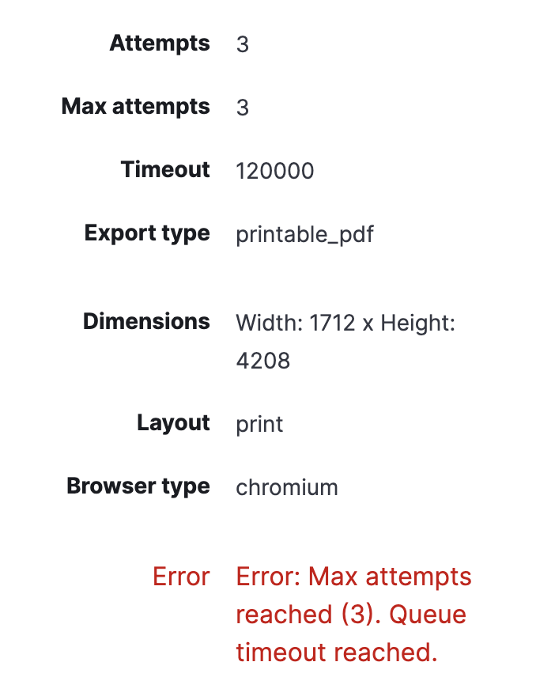

# Testing swap reporting performance notes

Reporting is currently running into resource limits due to the low RAM environment on Cloud. This set of tests simulates the cloud environment where Kibana
is deployed to.

## Notes

* Tests were run with the sample data set "Web logs"
* Elastic run command: `docker run --env-file ./elasticsearch-envfile --ulimit memlock=-1:-1 --network=esnet -p 9201:9200 --name myes docker.elastic.co/elasticsearch/elasticsearch:7.15.1`

## Docker run commands

Was not able to specify memory swap via docker-compose so various docker commands are used below.

## Logs of runs

* Logs for generating dashboard ./export-a.ndjson
* Generated reports using dashboard in ./export-a.ndjson

### 🏃🏻 memory 1gb, memory-swap=2gb, memory-swapiness=60, print-optimized

```sh
# Kibana
docker run --env-file ./kibana-envfile --memory=1gb --memory-swap=2gb --memory-swappiness=60 --network=esnet -p 5602:5601 --name mykbn docker.elastic.co/kibana/kibana:7.15.1
```

👉🏻 RESULT: CRASH ON ALL ATTEMPTS DUE TO FAILED MEMORY ALLOCATION

```
{"type":"log","@timestamp":"2021-11-08T11:18:59+00:00","tags":["info","plugins","reporting","runTask","printablePdf","printable_pdf","execute-job","kvqkm2w600xv1317b3fawmvi"],"pid":1219,"message":"screenshots taken: 1"}

<--- Last few GCs --->

[1219:0x53280c0]   314608 ms: Mark-sweep 513.2 (539.9) -> 509.2 (539.9) MB, 321.7 / 0.1 ms  (average mu = 0.157, current mu = 0.016) allocation failure scavenge might not succeed
[1219:0x53280c0]   314956 ms: Mark-sweep 513.2 (539.9) -> 509.2 (539.9) MB, 342.8 / 0.1 ms  (average mu = 0.091, current mu = 0.015) allocation failure scavenge might not succeed


<--- JS stacktrace --->

FATAL ERROR: Ineffective mark-compacts near heap limit Allocation failed - JavaScript heap out of memory
 1: 0xa25510 node::Abort() [/usr/share/kibana/node/bin/node]
 2: 0x9664d3 node::FatalError(char const*, char const*) [/usr/share/kibana/node/bin/node]
 3: 0xb9a8be v8::Utils::ReportOOMFailure(v8::internal::Isolate*, char const*, bool) [/usr/share/kibana/node/bin/node]
 4: 0xb9ac37 v8::internal::V8::FatalProcessOutOfMemory(v8::internal::Isolate*, char const*, bool) [/usr/share/kibana/node/bin/node]
 5: 0xd56ca5  [/usr/share/kibana/node/bin/node]
 6: 0xd5782f  [/usr/share/kibana/node/bin/node]
 7: 0xd6566b v8::internal::Heap::CollectGarbage(v8::internal::AllocationSpace, v8::internal::GarbageCollectionReason, v8::GCCallbackFlags) [/usr/share/kibana/node/bin/node]
 8: 0xd6922c v8::internal::Heap::AllocateRawWithRetryOrFailSlowPath(int, v8::internal::AllocationType, v8::internal::AllocationOrigin, v8::internal::AllocationAlignment) [/usr/share/kibana/node/bin/node]
 9: 0xd3790b v8::internal::Factory::NewFillerObject(int, bool, v8::internal::AllocationType, v8::internal::AllocationOrigin) [/usr/share/kibana/node/bin/node]
10: 0x107fbef v8::internal::Runtime_AllocateInYoungGeneration(int, unsigned long*, v8::internal::Isolate*) [/usr/share/kibana/node/bin/node]
11: 0x1426919  [/usr/share/kibana/node/bin/node]
```

---

### 🏃🏻 memory 1gb, memory-swap=3gb, memory-swapiness=60, print-optimized

```sh
docker run --env-file ./kibana-envfile --memory=1gb --memory-swap=3gb --memory-swappiness=60 --network=esnet -p 5602:5601 --name mykbn docker.elastic.co/kibana/kibana:7.15.1
```

👉🏻 RESULT: TIMEOUT ALL ATTEMPTS

```
{"type":"log","@timestamp":"2021-11-08T11:45:35+00:00","tags":["error","plugins","reporting","runTask"],"pid":1219,"message":"Error: Max attempts reached (3). Queue timeout reached.\n    at ExecuteReportTask._claimJob (/usr/share/kibana/x-pack/plugins/reporting/server/lib/tasks/execute_report.js:218:19)\n    at runMicrotasks (<anonymous>)\n    at processTicksAndRejections (internal/process/task_queues.js:95:5)\n    at Object.run (/usr/share/kibana/x-pack/plugins/reporting/server/lib/tasks/execute_report.js:359:22)\n    at TaskManagerRunner.run (/usr/share/kibana/x-pack/plugins/task_manager/server/task_running/task_runner.js:283:22)"}
```



---

### 🏃🏻 memory 1gb, memory-swap=4gb, memory-swapiness=60

👉🏻 RESULT: Same result as previous run...

---

### 🏃🏻 memory 1gb, memory-swap=4gb, memory-swapiness=60, 2m timeouts, print-optimized

```sh
docker run\
  --memory=1gb\
  --memory-swap=4gb\
  --memory-swappiness=60\
  --network=esnet\
  -p 5602:5601\
  --name mykbn\
  --mount type=bind,source=$(pwd)/reporting-cloud-memory-tests/kibana-2m-timeout.yml,target=/usr/share/kibana/config/kibana.yml\
  docker.elastic.co/kibana/kibana:7.15.1
```

👉🏻 RESULT: TIMEOUT ALL ATTEMPTS :(

---

### 🏃🏻 memory 1gb, memory-swap=4gb, memory-swapiness=60, 4m timeouts, print-optimized

```sh
docker run\
  --memory=1gb\
  --memory-swap=4gb\
  --memory-swappiness=60\
  --network=esnet\
  -p 5602:5601\
  --name mykbn\
  --mount type=bind,source=$(pwd)/reporting-cloud-memory-tests/kibana-4m-timeout.yml,target=/usr/share/kibana/config/kibana.yml\
  docker.elastic.co/kibana/kibana:7.15.1
```

👉🏻 RESULT: SUCCESSFULLY GENERATED REPORT!!

## Data for pixel:RAM relationship

### Notes

Sometimes there are dangling headless shell PIDs. Not exactly sure how this occurs. Could be something to do with Chromium
returning "page closed unexpectedly" error.

```
USER       PID %CPU %MEM    VSZ   RSS TTY      STAT START   TIME COMMAND
kibana       1  0.0  0.0   4368    20 ?        Ss   13:11   0:00 /bin/tini -- /usr/local/bin/kibana-docker
kibana       7  0.0  0.0 617132     0 ?        Sl   13:11   0:00 /usr/share/kibana/bin/../node/bin/node /usr/share/kibana/bin/../src/cli/dist --ops.cGroupOverrides.c
kibana    1219 11.6 15.9 1587608 324584 ?      Sl   13:11   3:27 /usr/share/kibana/node/bin/node --preserve-symlinks-main --preserve-symlinks /usr/share/kibana/src/c
kibana    1293  0.6  0.0 33879920 1228 ?       Ssl  13:14   0:11 /usr/share/kibana/x-pack/plugins/reporting/chromium/headless_shell-linux_x64/headless_shell --disabl
kibana    1295  0.0  0.0 33732192   0 ?        S    13:14   0:00 /usr/share/kibana/x-pack/plugins/reporting/chromium/headless_shell-linux_x64/headless_shell --type=z
kibana    1296  0.0  0.0 33732192   4 ?        S    13:14   0:00 /usr/share/kibana/x-pack/plugins/reporting/chromium/headless_shell-linux_x64/headless_shell --type=z
kibana    1360  0.7  0.0 33880212 1484 ?       Ssl  13:18   0:09 /usr/share/kibana/x-pack/plugins/reporting/chromium/headless_shell-linux_x64/headless_shell --disabl
kibana    1362  0.0  0.0 33732192   0 ?        S    13:18   0:00 /usr/share/kibana/x-pack/plugins/reporting/chromium/headless_shell-linux_x64/headless_shell --type=z
kibana    1363  0.0  0.0 33732192   0 ?        S    13:18   0:00 /usr/share/kibana/x-pack/plugins/reporting/chromium/headless_shell-linux_x64/headless_shell --type=z
kibana    1378  0.2  0.0 33784844   0 ?        Sl   13:18   0:03 /usr/share/kibana/x-pack/plugins/reporting/chromium/headless_shell-linux_x64/headless_shell --type=g
kibana    1436  0.0  0.0 33773304   0 ?        Sl   13:20   0:00 /usr/share/kibana/x-pack/plugins/reporting/chromium/headless_shell-linux_x64/headless_shell --type=g
kibana    1812  1.0  0.1  12052  3116 pts/0    Ss   13:41   0:00 /bin/bash
kibana    1818  0.0  0.1  44668  3244 pts/0    R+   13:41   0:00 ps uax
```

